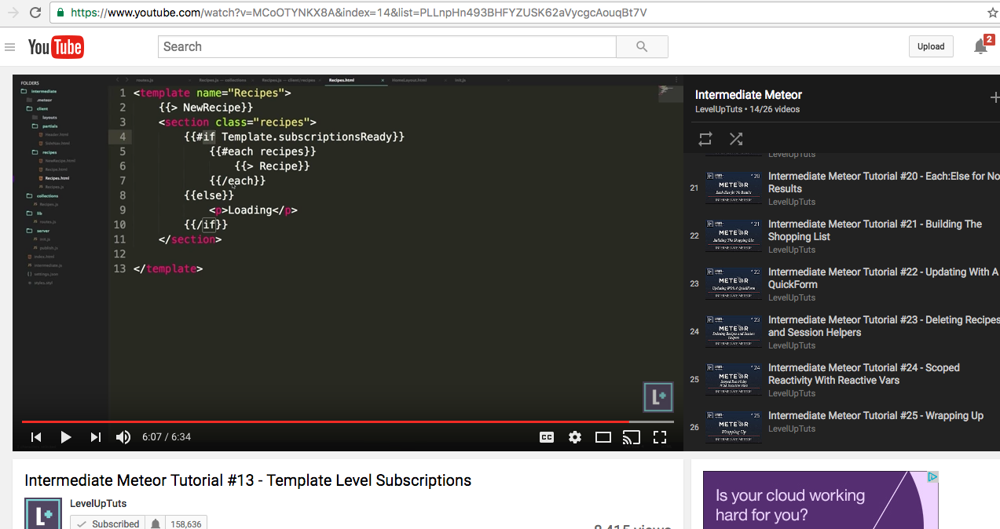
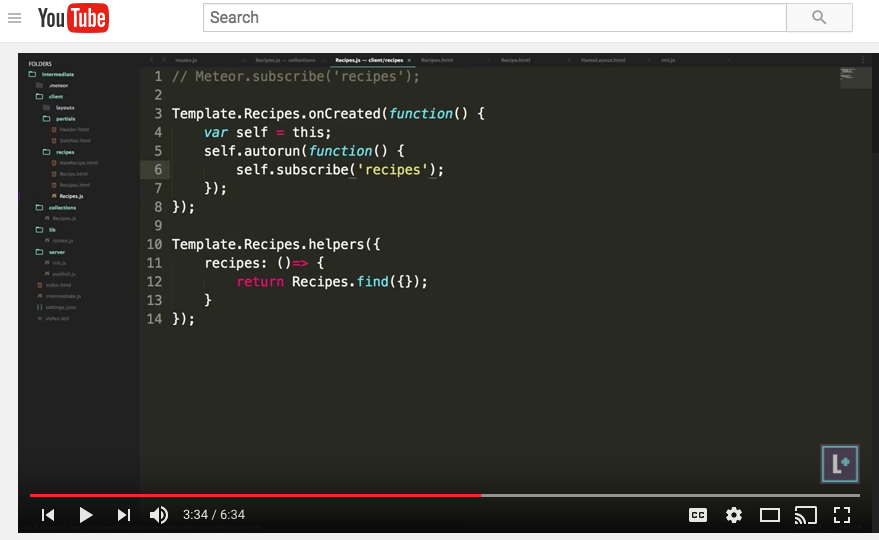

# Autorun
Use Templates.subscriptionsReady() to get any required subscriptions.

Subscriptions are properly handled inside the self.autorun();

# REFERENCES

From LevelUpTuts

https://www.youtube.com/watch?v=MCoOTYNKX8A&index=14&list=PLLnpHn493BHFYZUSK62aVycgcAouqBt7V
